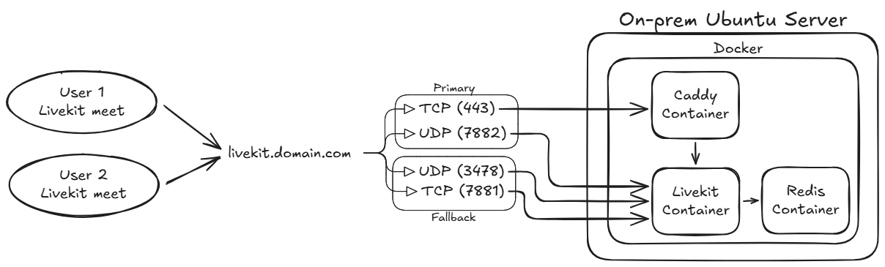

# LiveKit Server Setup

This repository contains scripts to automate the setup of a LiveKit server on a fresh Ubuntu instance.

## Prerequisites

*   A fresh Ubuntu server.
*   A domain name pointed to the IP address of your server.
*   SSL certificate and private key for your domain.

## Generating API Keys and Secrets

Before setting up LiveKit, you'll need an API Key and Secret. These are used to authenticate with your LiveKit server and generate tokens for clients. You can generate a new key pair using the provided bash script:

1.  **Make the script executable:**
    ```bash
    chmod +x livekit-key-secret-generator.sh
    ```

2.  **Run the script:**
    ```bash
    ./livekit-key-secret-generator.sh
    ```
    This will output a `Key` and a `Secret`. Copy these values, as you will need them for the `livekit-setup.sh` and `livekit-token-generator.sh` scripts.

## Setup Instructions


1.  **Clone the repository:**
    ```bash
    git clone https://github.com/FINUSAM/Livekit-Setup-using-Automation.git
    cd your-repository
    ```

2.  **Configure the setup script:**
    Open `livekit-setup.sh` and modify the following variables according to your configuration:
    ```bash
    LIVEKIT_DOMAIN="your-domain.com"
    API_KEY="your-api-key"
    API_SECRET="your-api-secret"
    ```

3.  **Run the setup script:**
    ```bash
    chmod +x livekit-setup.sh
    ./livekit-setup.sh
    ```
    This script will:
    *   Install Docker and Docker Compose.
    *   Configure LiveKit, Caddy, and Redis.
    *   Set up a systemd service to run LiveKit.

4.  **Add SSL certificates:**
    After the script runs, it will prompt you to add your SSL certificate and private key.
    *   Paste your certificate into `/opt/livekit/certs/domain.crt`.
    *   Paste your private key into `/opt/livekit/certs/domain.key`.

5.  **Restart the LiveKit service:**
    ```bash
    sudo systemctl restart livekit-docker
    ```

## Testing

1.  **Configure the token generator script:**
    Open `livekit-token-generator.sh` and modify the following variables to match your `livekit-setup.sh` configuration:
    ```bash
    API_KEY="your-api-key"
    API_SECRET="your-api-secret"
    ```
    You can also change the `ROOM` and `IDENTITY` for the token.

2.  **Run the token generator script:**
    ```bash
    chmod +x livekit-token-generator.sh
    ./livekit-token-generator.sh
    ```
    This will generate a client-side token that can be used to connect to your LiveKit server.

3.  **Test Connection:**
    Use the generated token with a LiveKit client (e.g., [LiveKit Connection Tester](https://livekit.io/connection-test)) to test connection.

3.  **Test Live Video Calling:**
    Use the generated token with a LiveKit client (e.g., [LiveKit Meet](https://example.livekit.io/?tab=custom)) to try live video calling.

## Configuration

### `livekit-setup.sh`

*   `LIVEKIT_DOMAIN`: Your domain name.
*   `LIVEKIT_CERTS_DIR`: Directory to store SSL certificates.
*   `LIVEKIT_CERT_FILE`: SSL certificate filename.
*   `LIVEKIT_KEY_FILE`: SSL private key filename.
*   `API_KEY`: Your LiveKit API key.
*   `API_SECRET`: Your LiveKit API secret.
*   `LIVEKIT_CONFIG_DIR`: Directory to store LiveKit configuration files.

### `livekit-token-generator.sh`

*   `API_KEY`: Your LiveKit API key.
*   `API_SECRET`: Your LiveKit API secret.
*   `ROOM`: The room name for the token.
*   `IDENTITY`: The user identity for the token.

### `livekit-key-secret-generator.sh`

*   This bash script generates a random `API_KEY` and `API_SECRET` for use with your LiveKit server.

## How it Works



The setup script automates the deployment of a LiveKit server using Docker and Caddy. Here's a breakdown of the architecture and how the different components work together:

### Core Components

*   **LiveKit Server (`livekit/livekit-server`):** The core of the setup. It handles WebSocket connections for signaling, and WebRTC for media.
*   **Redis (`redis:7-alpine`):** Used by LiveKit for message passing and state synchronization between different parts of the LiveKit server.
*   **Caddy (`livekit/caddyl4`):** A powerful, enterprise-ready open-source web server. In this setup, it acts as a Layer 4 proxy to handle TLS termination and port multiplexing.

### Port Configuration and Traffic Flow

*   **Port `443` (TCP):** This is the primary public entry point. Caddy listens on this port and handles initial incoming traffic.
    *   **Signaling (WebSocket):** When a client connects for signaling (e.g., to join a room), Caddy inspects the TLS ALPN (Application-Layer Protocol Negotiation). If it's `h2` or `http/1.1`, the traffic is proxied to the LiveKit server's internal WebSocket port (`7880`).
    *   **TURN (TLS):** If the ALPN is not `h2` or `http/1.1`, Caddy assumes it's a TURN connection and proxies the traffic to the LiveKit server's internal TURN/TLS port (`5349`). This allows LiveKit to serve both WebSocket and TURN/TLS traffic on the same public port.

*   **Port `7882` (UDP):** LiveKit's WebRTC/UDP port. This port *should* be open to the public internet for optimal direct WebRTC media flow. This is the preferred method for media transmission.

*   **Port `3478` (UDP):** LiveKit's TURN/UDP port. This port *must* be open to the public internet. If direct WebRTC connection on port `7882` UDP is not possible (e.g., due to NAT/firewall issues), clients will fall back to using TURN to relay UDP media through this port.

*   **Port `7881` (TCP):** LiveKit's WebRTC/TCP port. This port *should* be open to the public internet. It serves as a fallback for clients on highly restrictive networks that block UDP traffic entirely, allowing them to connect to LiveKit over TCP for media transmission.

The following ports are used internally by LiveKit and are not intended for direct public access (they are proxied by Caddy or used for internal service communication):
*   **Port `7880` (TCP):** LiveKit's internal WebSocket signaling port.
*   **Port `5349` (TCP):** LiveKit's internal TURN/TLS port.

### UDP Muxing

LiveKit uses a feature called UDP muxing, which allows it to handle both WebRTC and TURN traffic on the same UDP port (`7882`). This simplifies firewall configurations and improves connection reliability.

### Automation and Orchestration

*   **Docker & Docker Compose:** The entire setup is containerized using Docker. The `docker-compose.yaml` file defines the three services (LiveKit, Redis, and Caddy) and their configurations. Using `network_mode: "host"` simplifies the networking by allowing the containers to use the host's network stack directly.
*   **`livekit-setup.sh`:** This script automates the entire process:
    1.  Installs Docker.
    2.  Generates configuration files for LiveKit, Caddy, and Redis.
    3.  Creates placeholder SSL certificate files.
    4.  Sets up a `systemd` service to manage the Docker Compose application.
*   **`systemd` (`livekit-docker.service`):** This systemd service ensures that the LiveKit server starts automatically on boot and restarts if it fails. It manages the Docker Compose application, making it easy to start, stop, and check the status of the server.
